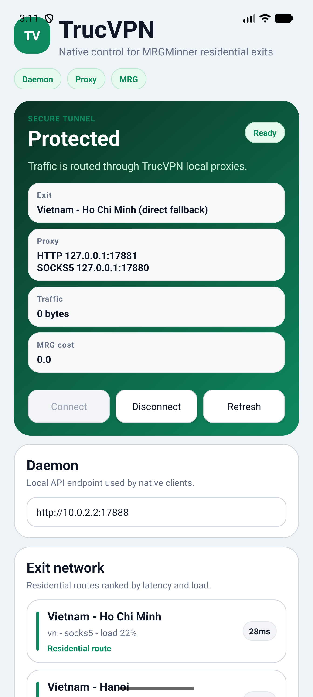

# TrucVPN

TrucVPN is a native-client VPN control surface for the MergeOS MRG bandwidth economy.

The Node.js core runs a local SOCKS5/HTTP proxy and a small control daemon. Native apps and browser extensions talk to that daemon to connect, disconnect, choose exits, and route browser traffic through TrucVPN.

## Native UI preview

The Android client is a real native app with a polished control surface for daemon status, local proxy ports, MRG metering, and residential exit selection.



## What is included

| Surface | Path | Status |
| --- | --- | --- |
| Local control daemon | `src/dashboard.js` | `GET/POST` JSON API for apps/extensions |
| Android native app | `apps/android` | Java Android SDK app, no WebView |
| iOS native app | `apps/ios` | SwiftUI app scaffold |
| Chrome extension | `extensions/chrome` | MV3 popup + browser proxy control |
| Firefox extension | `extensions/firefox` | WebExtension popup + browser proxy control |

## Quick start

```powershell
npm test
node .\bin\trucvpn.js daemon --host 0.0.0.0 --port 17888
```

The daemon exposes:

| Endpoint | Purpose |
| --- | --- |
| `GET /api/health` | Daemon health and metadata |
| `GET /api/status` | Connection state and proxy ports |
| `GET /api/exits` | Live or sample exit catalog |
| `GET /api/config` | Public runtime config |
| `POST /api/config` | Update runtime config |
| `POST /api/connect` | Connect through a selected exit |
| `POST /api/disconnect` | Disconnect current session |
| `GET /api/proxy.pac` | PAC file for HTTP proxy routing |

## Android

Build the native Android app:

```powershell
cd apps\android
$env:ANDROID_HOME="$env:LOCALAPPDATA\Android\Sdk"
$env:ANDROID_SDK_ROOT=$env:ANDROID_HOME
.\gradlew.bat assembleDebug
```

Install on an emulator:

```powershell
$adb="$env:LOCALAPPDATA\Android\Sdk\platform-tools\adb.exe"
& $adb -s emulator-5554 install -r .\app\build\outputs\apk\debug\app-debug.apk
& $adb -s emulator-5554 shell am start -n shop.mergeos.trucvpn/.MainActivity
```

Use `http://10.0.2.2:17888` inside the Android emulator. Use your computer LAN IP when testing on a physical phone.

## iOS

Open the SwiftUI project in Xcode:

```powershell
start apps\ios\TrucVPN.xcodeproj
```

Use `http://127.0.0.1:17888` in the iOS simulator. Use your Mac LAN IP on a physical iPhone.

## Browser extensions

Start the daemon first:

```powershell
node .\bin\trucvpn.js daemon --host 127.0.0.1 --port 17888
```

Chrome:

1. Open `chrome://extensions`.
2. Enable Developer mode.
3. Load unpacked from `extensions/chrome`.

Firefox:

1. Open `about:debugging#/runtime/this-firefox`.
2. Load Temporary Add-on.
3. Choose `extensions/firefox/manifest.json`.

When connected, extensions set the browser proxy to TrucVPN's local HTTP proxy and clear it on disconnect.

## Browser split-tunnel examples

Keep the control daemon bound to localhost and choose ports explicitly so the
browser settings below match the running TrucVPN instance:

```powershell
node .\bin\trucvpn.js configure --socks-port 17880 --http-port 17881 --dashboard-host 127.0.0.1 --dashboard-port 17888 --region auto
node .\bin\trucvpn.js daemon --host 127.0.0.1 --port 17888
```

Choose one browser policy:

- **Extension-only routing:** load the Chrome or Firefox extension described
  above. The extension routes that browser through TrucVPN's local HTTP proxy;
  applications outside the browser continue to use their normal connection.
- **Dedicated browser profile:** set only that profile's HTTP and HTTPS proxy
  to `127.0.0.1:17881`. Leave the operating-system proxy disabled so other
  browsers and applications remain direct.
- **PAC policy:** set the browser's automatic proxy URL to
  `http://127.0.0.1:17888/api/proxy.pac`. The generated policy sends localhost,
  `127.0.0.1`, and plain host names directly, then uses the TrucVPN HTTP proxy
  with a direct fallback for other requests.

Confirm the local control service is reachable at the
[TrucVPN dashboard health endpoint](http://127.0.0.1:17888/api/health), then use
`trucvpn status` to verify the active proxy ports. These examples use only CLI
flags implemented by `trucvpn configure` and `trucvpn daemon`.

## CLI

| Command | Purpose |
| --- | --- |
| `trucvpn version` | Print version JSON |
| `trucvpn configure` | Configure ports, share URL, region, kill switch |
| `trucvpn list` | List live/sample exits |
| `trucvpn connect` | Start local SOCKS5/HTTP proxies |
| `trucvpn disconnect` | Stop current session |
| `trucvpn status` | Show connection and traffic |
| `trucvpn doctor` | Print health report |
| `trucvpn daemon` | Start local JSON control daemon |

## Architecture

```text
Native app / extension
    |
    v
TrucVPN control daemon :17888
    |
    v
Local SOCKS5 :17880 / HTTP :17881
    |
    v
MRGMinner share exit or direct fallback
    |
    v
Internet
```

Sharers earn MRG by running MRGMinner share nodes. Consumers route traffic through available residential exits.

## Development

```powershell
npm test
node .\bin\trucvpn.js doctor
```

## License

MIT. See `LICENSE`.
